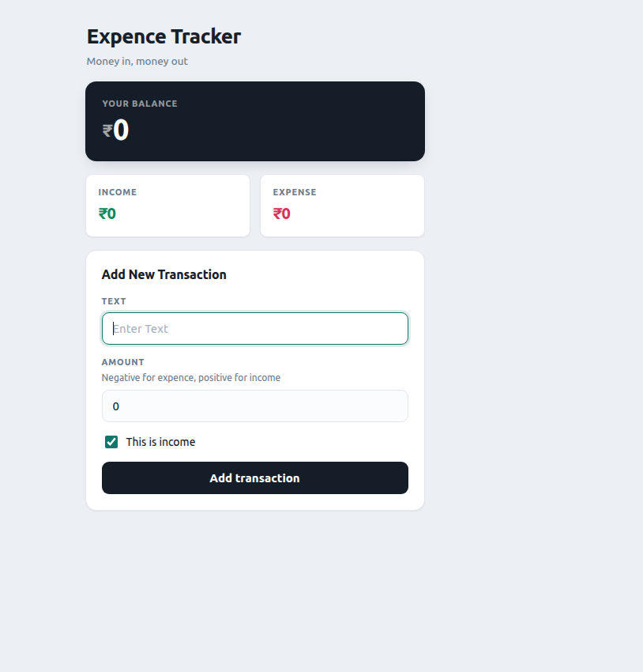
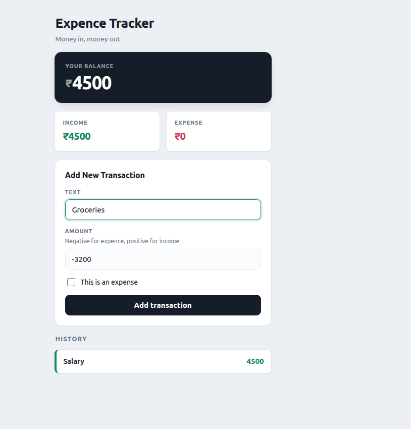
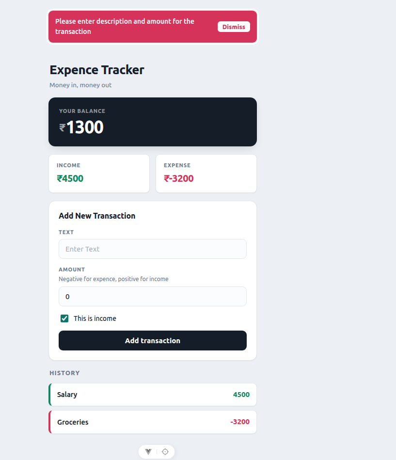

# Expence Tracker

A small Vue 3 app for tracking income and expenses — built as a learning project to
practice the Composition API one feature at a time. Every feature below was added to
force one specific Vue topic into actual use, not just read about.

## Flow (screenshots)

Three moments that show the app end to end.

### 1. Empty state
_A fresh load, before anything is added — `localStorage` cleared._



### 2. Filling the form
_Mid-way through an expense — text entered, amount typed as `-3200`, toggle set to
"This is an expense"._



### 3. Validation error
_Submitted with both Text and Amount empty — the red banner from `onErrorCaptured`,
focused automatically via `nextTick`. Also shows the balance/expense math working:
Income ₹4500, Expense ₹-3200, Balance ₹1300._



---

## Topics covered

What each one is actually doing in this app — not a generic definition.

### JavaScript

- **`const` / `let`** — every variable declaration in the app.
- **Arrow functions** — the short `item => item.isIncome` form used inside every
  `.filter()`, `.reduce()`, `computed()` and `watch()` callback.
- **`.filter()`** — `income` and `expence` in `App.vue` each filter `history` down to
  just the income rows or just the expense rows before adding them up.
- **`.reduce()`** — turns that filtered list into one number, by adding `item.amount`
  onto a running `sum`.
- **Template literals** — `` `₹${balance.value} · Expence Tracker` `` builds the
  browser tab title from the live balance.
- **Optional chaining (`?.`)** — `event.target?.tagName` and `textInput.value?.focus()`
  in `Transaction.vue`, so nothing throws if the value happens to be `null`.
- **`throw new Error()`** — `sendTransaction()` throws instead of silently returning
  when Text or Amount is missing, so the failure is visible instead of invisible.
- **Truthiness checks** — `!text.value.trim()` and `!amount.value` catch an empty
  string, `0`, and `NaN` all in one check.

### Template syntax

- **`{{ }}` interpolation** — `{{ errorMessage }}`, `{{ balance }}`, and every other
  piece of text pulled from script into the template.
- **`v-bind` / `:`** — `:balance="balance"`, `:history="history"`, and the rest of the
  props passed down to child components.
- **`v-on` / `@`** — `@submit.prevent`, `@click`, `@change` (used internally by
  `v-model`).
- **`v-if` / `v-else`** — twice: showing the error banner only when there's a message,
  and colouring a history row green or red depending on `his.isIncome`.
- **`v-for` + `:key`** — `History.vue` renders one row per transaction; `:key="his.id"`
  tells Vue which DOM row belongs to which transaction when the list changes.
- **`v-model`** — on the Text input, the Amount input, and now the income/expense
  checkbox — three different input types, same directive.
- **`v-model.number`** — on Amount, so `"2000"` (a string) is stored as `2000` (a
  number), which is what the `>= 0` sign check in `isIncome` needs.
- **`.prevent` modifier** — `@submit.prevent` stops the browser's default full-page
  reload on form submit.
- **`:class`** — static classes throughout (`class="entry"`, `class="tile--income"`)
  that combine with the shared CSS tokens in `main.css`.

### Reactivity

- **`ref()`** — `text`, `amount`, `errorMessage`, `textInput` — single values that
  need `.value` to read or write.
- **`reactive()`** — `history`, the transaction list. Because it's `reactive`, calling
  `history.push(...)` anywhere is enough for every computed and the template to notice.
- **Read-only `computed()`** — `income`, `expence`, and `balance` are never assigned to
  directly; they're recalculated from `history` automatically whenever it changes.
- **Writable `computed({ get, set })`** — `isIncome` in `Transaction.vue`. Reading it
  checks whether `amount` is positive; ticking/unticking the checkbox calls its `set()`,
  which flips the sign of `amount` for you.
- **`watch()` with `{ deep: true }`** — saves `history` to `localStorage` every time it
  changes. `deep: true` is required because `push()` changes what's *inside* the array,
  not the array reference itself.
- **`watchEffect()`** — keeps the browser tab title in sync with `balance`, without
  ever naming `balance` as something to watch — it works that out automatically.

### Components

- **Importing a child component** — `App.vue` imports and uses all five components in
  `src/components/`.
- **`defineProps` with a `type` option** — every child declares what it expects to
  receive (`history: { type: Array }`, `balance: { type: Number }`, etc.).
- **`defineEmits` with a payload** — `Transaction.vue` emits `send-transaction` with an
  object (`{ text, amount }`), not just a bare event.
- **One-way data flow** — no child ever mutates a prop directly; `Transaction.vue` asks
  its parent to add the transaction instead of touching `history` itself.
- **Template refs (`ref="..."`)** — `ref="textInput"` and `ref="errorBanner"` give the
  script direct access to the real DOM element, so `.focus()` can be called on it.

### Lifecycle

- **`onMounted()`** — in `Transaction.vue`: focuses the Text input the instant the
  component is on the page, and attaches a `window` keydown listener.
- **`onUnmounted()`** — removes that same listener, so it can't be left behind or
  stacked twice.
- **`nextTick()`** — in `App.vue`'s error handler: waits for the error banner to
  actually exist in the DOM (it's behind a `v-if`) before trying to focus it.
- **`onErrorCaptured()`** — catches the `Error` thrown inside `Transaction.vue`'s
  `sendTransaction()`, even though that function lives in a different component, and
  turns it into a visible message instead of a console crash.

### Browser APIs

*Not Vue — plain JavaScript the app happens to use.*

- **`localStorage` (`getItem`/`setItem`)** — reads the saved transaction list on
  startup, and writes it back on every change.
- **`JSON.parse` / `JSON.stringify`** — `localStorage` can only store strings, so the
  real array is converted to text going in and back out.
- **`document.title`** — set inside `watchEffect()` to show the live balance in the
  browser tab.
- **`window.addEventListener` / `removeEventListener`** — the `n`-key shortcut that
  refocuses the Text input from anywhere on the page.

### Tooling

- **`<style scoped>`** — every component's styles, kept from leaking into any other
  component.
- **CSS custom properties** — colours and spacing (`--card`, `--expence`, `--radius`,
  …) defined once in `main.css` and reused inside every scoped `<style>` block.
- **npm scripts** — `npm run dev` for local development, `npm run build` for a
  production build.

---

## Project Setup

```sh
npm install
```

### Compile and Hot-Reload for Development

```sh
npm run dev
```

### Compile and Minify for Production

```sh
npm run build
```

## Recommended IDE Setup

[VS Code](https://code.visualstudio.com/) + [Vue (Official)](https://marketplace.visualstudio.com/items?itemName=Vue.volar) (and disable Vetur).

## Recommended Browser Setup

- Chromium-based browsers (Chrome, Edge, Brave, etc.):
  - [Vue.js devtools](https://chromewebstore.google.com/detail/vuejs-devtools/nhdogjmejiglipccpnnnanhbledajbpd)
  - [Turn on Custom Object Formatter in Chrome DevTools](http://bit.ly/object-formatters)
- Firefox:
  - [Vue.js devtools](https://addons.mozilla.org/en-US/firefox/addon/vue-js-devtools/)
  - [Turn on Custom Object Formatter in Firefox DevTools](https://fxdx.dev/firefox-devtools-custom-object-formatters/)

## Customize configuration

See [Vite Configuration Reference](https://vite.dev/config/).
